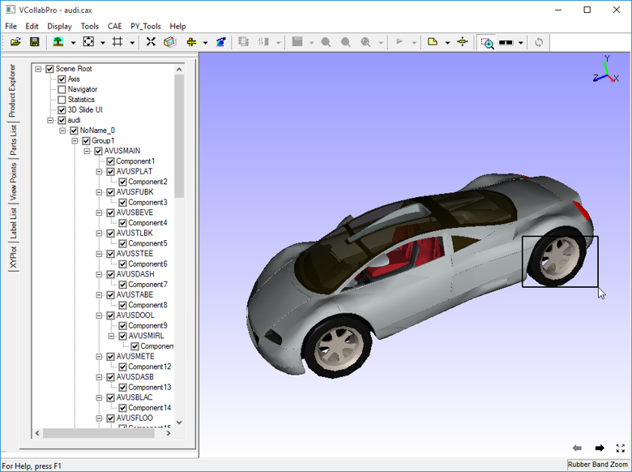
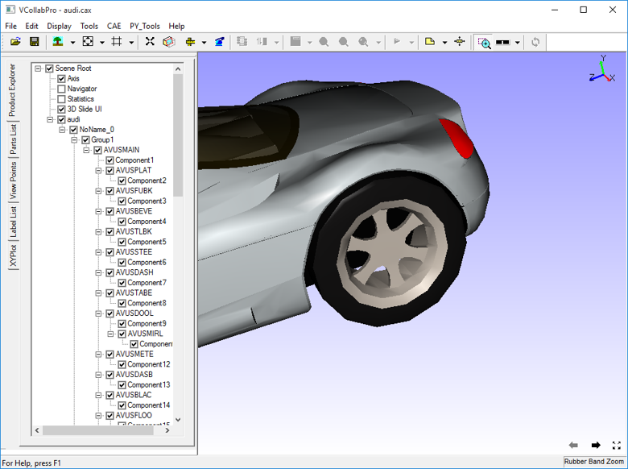

Zoom Region
============

VCollab Pro users can use the **Zoom Region** option to magnify and view
inner details of a model.

**Steps to use Zoom Region**

-  Click **Tools \| Zoom Region** to enable.

-  Move the mouse to the region.

-  Left click and hold.

-  Drag the mouse and notice that a rectangle is drawn.

-  Drag further until the region to be zoomed is covered by the
   rectangle.

|image1|

-  Release the mouse button up and notice that the region is zoomed with
   animation.

|image2|

-  Repeat the above steps for magnifying further.

