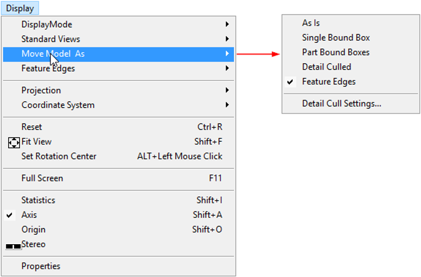
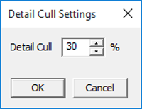
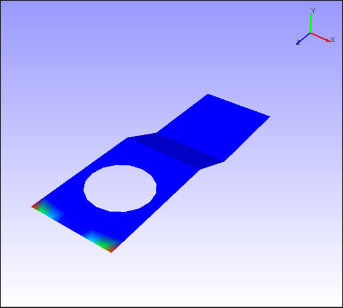
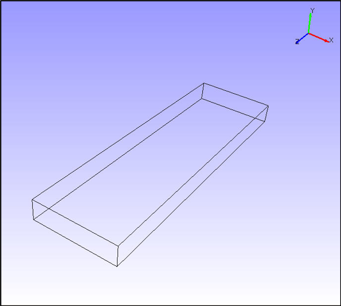
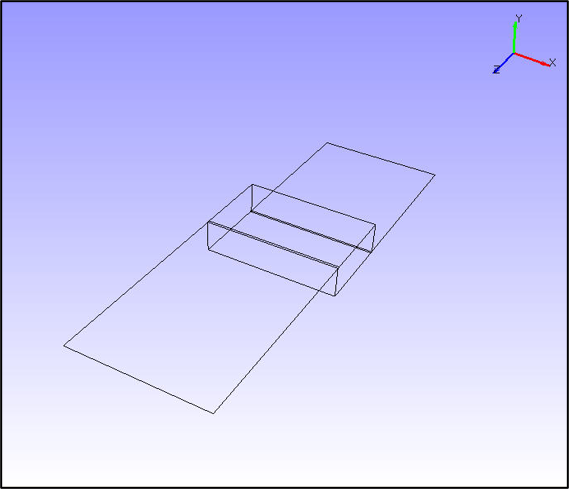
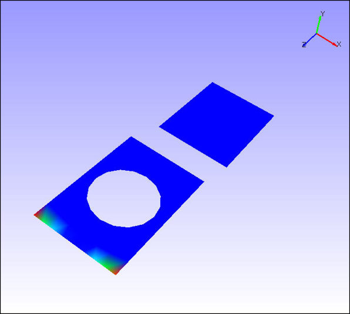
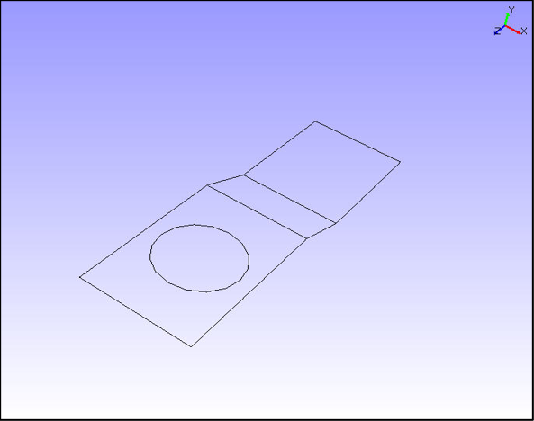

Move Model As

VCollab Pro users can set different performance modes of rendering while
interacting with a scene through a motion model using **Move Model As**.
The options found under this tool increase performance during the motion
model.

|image1|

**Options**

-  **As Is:** This is the default option and lets a user to change from
   any other performance mode to current display mode.

-  **Single Bounding box:** A single bounding box which contains all
   parts of the model displayed in motion model.

-  **Part Bounding boxes:** Individual bounding boxes are displayed for
   each part in the motion model.

-  **Detail culled:** This helps users to view parts based on the model
   volume. Users can view parts which are equal or above
   volumetrically with model volume. The default detail cull
   percentage is 30%.

..

   |image2|

-  **Feature Edges:** Shows model feature edges during motion model.

As Is or Normal

|image3|

Single Bounding Box

|image4|

Part Bounding Box

|image5|

30% Detailed cull Performance

|image6|

Feature Edges

|image7|

