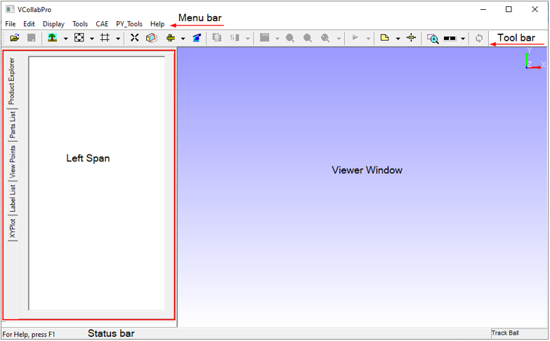
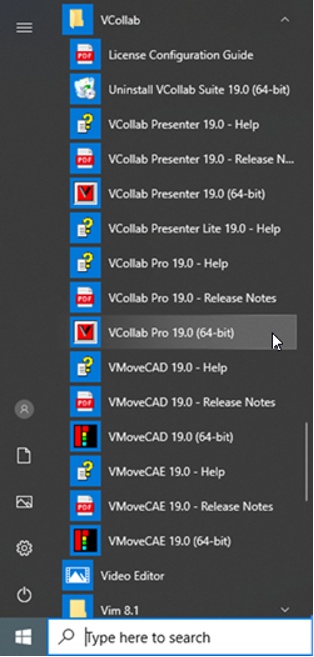

GUI Layout
=======================

VCollab Pro provides an intuitive and easy to use GUI. The various components of the screen are explained below. 

                                   |prolayout|

**Menu Bar**

The menu bar lists the menu items provided by the application. Each of these contain further submenus in the drop down list. 

**Toolbar**

The toolbar provides a shortcut to access commonly used menu items. Each button on the toolbar refers to a menu item.  

**Status Bar**

The status bar is located at the bottom of the screen  and gives a description of the item selected in the menu bar. 

**Left Span**

Left Span contains Product Explorer, Part List, View Points and Label List tabs. The Product Explorer tab is in active mode by default. These options are explained in detail under Edit Menu.

**Viewer Window**

Viewer window is displayed by default when the application is initialized. The selected object or model is loaded in the viewer window. Users can view various simulations and different views of the object in the viewer window. 

**VCollab Pro Location**

On a WIndows system, VCollab Pro can be accessed from the following path

           **Start | Programs | VCollab |VCollab Pro**

 
                      |prolocation|

     
