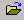
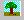
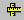

Quick Reference
===============

**What is CAX file?**

 CAX file is a native proprietary file format of VCollab. CAX files can be generated using VMoveCAE or VMoveCAD or VRML2CAX or CAX Writer API. 

**How to generate a CAX file from Native CAD/CAE softwares?**

 VMoveCAE, a product from VCollab, converts CAE result files from many native FEA and CFD codes into CAX files. Read VMoveCAE user guide to know more about the FEA/CFD codes that are supported.

 Similarly, VMoveCAD, a product from VCollab, converts CAD models/geometries from many popular native CAD formats into CAX files. Refer to the VMoveCAD user guide to learn more about the native CAD formats that are supported.

**How to Open a CAX file?**

-  Click `File <FileMenu.html>`__ menu and choose the menu item
   `Open <File_Open_Pro.html>`__ or click |image0| in the toolbar.
-  An open file browser dialog is displayed.
-  Select the file to be opened and click open button.
-  The selected file will be loaded in the viewer window.

**How to use Product Explorer?**

-  Product Explorer Window will be displayed in the left span of main
   window by default.
-  If not, click the `Edit <EditMenu_Pro.html>`__ menu and select menu
   item `Product Explorer <Edit_ProductExplorer_Pro.html>`__ or click
   |image1| in the toolbar
-  This displays the product explorer window, which shows the
   list/hierarchy of parts of the model/simulation.

**How to load CAE Results?**

-  Choose `CAE <CAEMenu_Pro.html>`__ menu.
-  Select `Result List <CAE_Results_Pro.html>`__. or click
   |image2| in the toolbar.
-  Select a result from popped up CAE result dialog box.
-  Select an instance from 'Instance' drop down list, if needed.
-  Select a derived type from 'Derived Type' drop down.
-   Notice that selected CAE results are applied on the CAE model in the viewer.

**How to activate CAE Animation?**

-  Click `CAE <CAEMenu_Pro.html>`__ menu.
-  Click `Animate <CAE_Animate_Pro.html>`__ or click |image3| in toolbar.
-  Use popped up dialog to manage animation.

**How to set CAE Animation mode?**

-  Click `CAE <CAEMenu_Pro.html>`__ menu.
-  Click `Animation settings <CAE_AnimationSettings_Pro.html>`__.
-  Choose animation mode from the Animation type drop down list.

**How to look at Standard Views?** 

-  Click on the `Display <DisplayMenu_Pro.html>`__ menu and select
   `Standard Views <Display_StandardViews_Pro.html>`__ option.
-  The various sub options listed are Top View, Bottom View, Right View, Left View, Front View, Back View and Isometric Cabinet.
-  Click a standard view and notice the change in the viewer.

**How to create a Viewpoint Animation?**

-  Create View points using `Edit <EditMenu_Pro.html>`__ **\|**
   `ViewPoints <Edit_ViewPoints_Pro.html>`__
-  Create a path with these view points.
-  Click right mouse button in view points panel.
-  Click Animate Path in the drop down context menu.

**How to Show/Hide parts?**

-  Select the `Edit <EditMenu_Pro.html>`__ menu and choose the
   `Product Explorer <Edit_ProductExplorer_Pro.html>`__ option.
-  Uncheck the desired part in the product tree to hide.
-   Alternately, one can double click on a part in the viewer window   with left mouse button. 
-   That would select a part as well as open the Viewer->Context menu.
-   Then select Hide option. 

**How to resize Product Explorer?**

-  By default, Product explorer is docked in the main Window.
-  Double click on top layer to detach it from main window.
-  User can resize now.
-  Double click on top layer to dock into main window again.

**How to change CAE legend colors?**

-  Click `CAE <CAEMenu_Pro.html>`__ menu and Click `Legend/Hotspot
   Settings <CAE_ContourSettings_Pro.html>`__ or click |image4| in
   toolbar.

-  Click 'Edit Legend' Tab.

-  Select Number of colors in the drop down list under palette to change
   number of colors.

-  Click a specific color in the palette to change individual color.

-  Select a color or define a custom color in the popped up color picker
   dialog.

-  Click 'Apply' to apply the changes in the viewer.

**How to change CAE Result range?**

-  Click `CAE <CAEMenu_Pro.html>`__ menu and Click `Legend/Hotspot
   Settings <CAE_ContourSettings_Pro.html>`__ or click |image5| in
   toolbar.

-  Click 'Update Legend' Tab.

-  Click both the check boxes provided for Min and Max.

-  Enter new range.

-  Click 'Update Current Instance' to apply the change in current frame
   alone.

-  Click 'Update All Instances' to apply the change to all frames.

**How to find distance between two points in the model?**

-  Click `Tools <ToolsMenu_Pro.html>`__ menu and click `Measurement \|
   3DDistance <Tools_3DDistance_Pro.html>`__ option or click |image6| in
   toolbar.
-  Click a start point on model.
-  Click an end point on the model.
-  The distance value is displayed in the annotated label.

**How to pick and move a part?**

-  Select a part or group of parts
-  Click `Tools <ToolsMenu_Pro.html>`__ menu and click
   `Pick <Tools_Assembly_Pro.html>`__

    Or

-  Click |image7| in toolbar.
-  Drag with right mouse button to move the part.
-  Select Pick option again to drop the part

**How to set exploded view?**

-  Click `Tools <ToolsMenu_Pro.html>`__ menu and click Explode or click
   |image8| in toolbar.
-  Click 'Explode' button in the popped up dialog to set exploded view.
-  Click 'Animate' check box to enable animation while exploding model.

**How to probe CAE Result?**

-  Click `CAE <CAEMenu_Pro.html>`__ menu and click
   `Probe <CAE_Probe_Pro.html>`__ or click |image9| in toolbar.
-   Click on a node / element to probe the result.
-   "Probe+Shift+Click" probes the whole transient result history as a   table. 
-   "Probe+Ctrl+Click" on a node creates the XYplot label.

**How to move labels?**

-  Click `Tools <ToolsMenu_Pro.html>`__ menu, click Labels/Notes and
   Select Move Labels

        Or

-  click |image10| in toolbar.
-  Click on a label and move the mouse pointer to the new position.
-  Click on the new position.

**How to create movie files from set of external images?**

-  Click `File <FileMenu.html>`__ menu and click
   `Export <File_Export_Pro.html>`__.

-   Select Make Movie option.

-   Provide input folder path which contains all images.
-   Provide output file path name.
-   Change frame rate if necessary.
-   Click Create.
-   Movie is created and confirmed with a message "Successfully   Captured".

**How to get better performance in rendering?** Or **How to increase
frame rate while interacting with model?**

-  Click `Display <DisplayMenu_Pro.html>`__ menu and click `Move Model
   As <Display_RenderSceneAs_Pro.html>`__.
-  Select any one performance option.
-  Observe that frame rate is increased while interacting with model.

**How to measure an arc or circle in the model?**

-  Click `Tools <ToolsMenu_Pro.html>`__ menu.
-  To measure an arc, click `Measurement \| 3Point
   Arc <Tools_3PointArc_Pro.html>`__.
-  Click start point of arc.
-  Click any point on the curve between start and end of arc.
-  Click end point of arc.
-  An arc is drawn through these three points with center.
-  Further an annotated label is display with arc information.
-  To measure a circle, click `Measurement \| 3 Point
   Circle <Tools_3PointCircle_Pro.html>`__.
-  Click any three points on circular curve.
-  A circle is drawn with center and an annotated label with circle
   information is displayed.

**How to view cross section of model?**

-  Click `Tools <ToolsMenu_Pro.html>`__ menu and click
   `Section <Tools_Section_Pro.html>`__ option.
-   Define a plane using the popped up section manager dialog.
-   Click show planes to view the section plane.
-   Use control sliders to translate and rotate the section planes.
-   Click Section Plane Location button to know the plane intercepts   with the coordinate axes.
-   Please note that these cross sections are created for visualization   purpose

**How to merge more than one model into scene?**

-  Click `File <FileMenu.html>`__ menu.
-  Notice that 'Merge' option is disabled.
-  Load a model using `File \| Open <File_Open_Pro.html>`__.
-  Click `File \| Merge <File_Merge_Pro.html>`__.
-  Select a model to be merged.
-  Click 'OK' to merge.

**How to enable vector plot?**

-  Click `CAE <CAEMenu_Pro.html>`__ menu.
-  Select `Display \| Vector Plot <CAE_Display_VectorPlot_Pro.html>`__
-  Click CAE \| CAE Settings to change vector plot settings.

**How to view CAE XYPlot?**

-  Click `CAE <CAEMenu_Pro.html>`__ menu.
-  Select `Display \| XYPlot <CAE_Display_XYPlot_Pro.html>`__
-  CAE settings dialog will be popped up with XYPlot tab.
-  Click X axis radio
-  Select an attribute in the data type combo.
-  Click Y axis radio.
-  Select a result in the data type combo.
-  Select a derived part in the derived type combo.
-  Ensure Probe option is enabled.
-  Click on the node or element of interest.
-  The curve will be plotted in the viewer.

