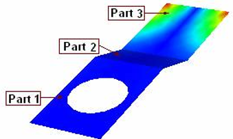
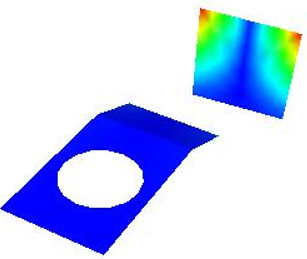
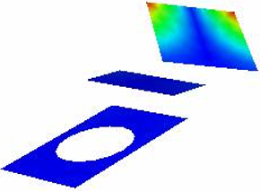

Pick
=============
VCollab Pro users can interact with the individual parts of a model by using the Pick tool available in the Tools menu. 

The **Pick** tool helps users to:

- Pick a part
- Apply transformation only to that part
- Assemble to the product and 
- Drop the part. 

Once a part is picked by this command, motion model transformation is made applicable to the part alone until **Pick** is selected again.

Once this option is disabled, motion model transformation is made available globally.

**Steps to pick and drop a part**

- Click **Tools | Pick** 
- Click a part in the model .
- Apply transformations and notice that all transformations are applicable only to that part.
- Click **Tools | Pick** again.
- Apply transformations and notice that they apply to the whole model and are not specific to the 
  part.

**Loaded Model**

   |image1|

- Part 3 is picked and transformations are applied

   |image2|

- Part 3 is unpicked and Part 1 is picked and transformed to a new state

   |image3|

