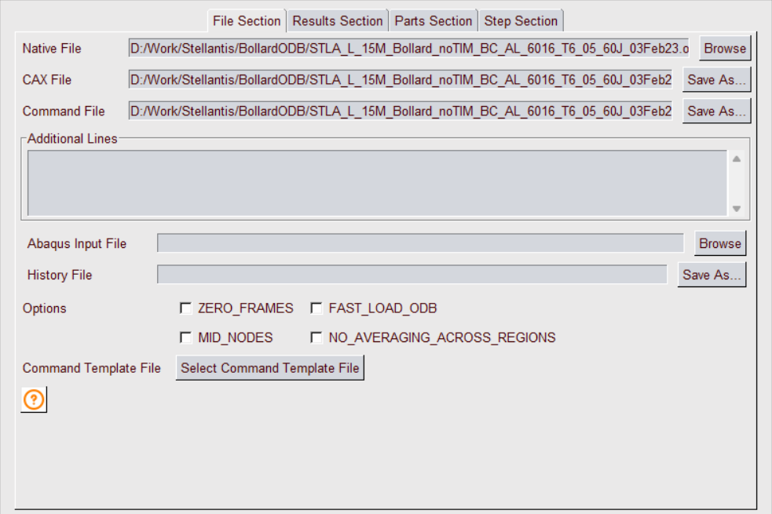
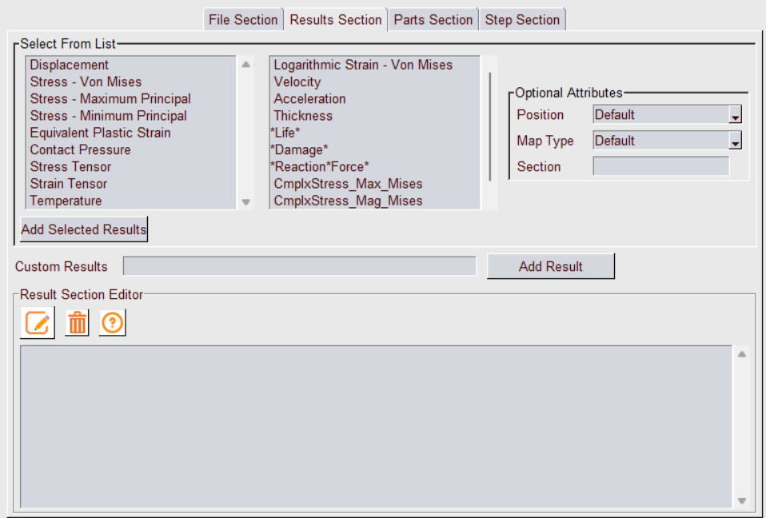
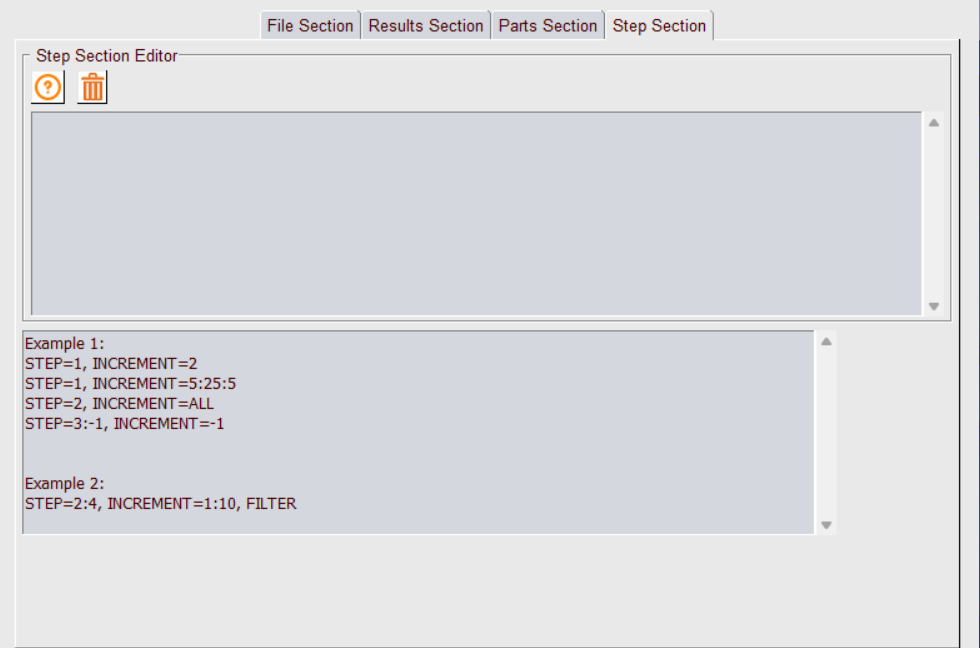

***************************************
GUI to Create CAX using VMoveCAESubmit
***************************************

.. |Help| image:: media/Help.png

.. |editiconN| image:: media/editiconN.png

**VMoveCAESubmit** is a VCollab Tool to convert CAX file from a native CAE file based on the parameters specified in a txt file. This GUI tool is developed to simplify CAX file creation using VMoveCAESubmit. Using this tool user can select or specify list of commands or parameters for File, Result, Parts and Step sections and create VMoveCAESubmit  parameter file. This Command parameter file can be run to create and load CAX file in VCollabPro. This help manual explains the functionalities of this tool. 

General help for VMoveCAESubmit command parameters is available in https://training.vcollab.com/Translators/VMoveCAE/Submit/usage.html

File Section
=============

Used to specify VMoveCAE which files to use.

- **Native File**: Specify the Native CAE file which need to be converted to CAX. 

- **Cax File**: This field specifies the path for the CAX file to be saved. This is auto filled once the Native file is selected (If the Native file folder has the write permission). User can modify this CAX file path as required.

- **Command File**: This is the path where VMoveSubmit Command File is saved. This field as well is auto-filled once the Native file is selected. User can edit this path and specify the location where Command File is to be saved. If this field is empty or not valid, Command file is saved in <VCollab Tempfile Path>.

- **Additional Lines**: This field is used to specify additional file section input lines (based on the native files). For certain native files, It may be required to add additional files. 

For example, ds.dat command file can be specified along with native ANSYS rst file ::

    - ds.dat, TYPE=ANSYS_CMDS

For Fluent .cas file, it is required to append .dat file ::

    - blower.dat, TYPE=FLUENT_DAT

Additional results (such as fatigue) files can be added as additional lines ::

    - abc.dma, TYPE=FEMFAT_DMA, CONTENT=RESULTS
    - abc.csv, TYPE=VCOLLAB_CSV
    - abc.npz, TYPE=NUMPY_NPZ

- **Abaqus Input File**: This is an optional selection. This field is activated only if Abaqus .odb file is selected as Native file. As the name suggests user can select Abaqus .inp file to create **entity sets** (CONTENT=ENTITY_SETS) instead of odb.

- **History File**: This is an optional selection. This field is activated only if Abaqus .odb file is selected as Native file. Specify the path to save history data file in json format.

- **Options**: Specify the file specific load and translation options. 
    - *ZERO_FRAMES* : Select this option to include Frame number Zero for each Step (LxM0)
    - *FAST_LOAD_ODB* : Select this option only if all the frames in the ODB file have same set of results.
    - *MID_NODES* : Select this option to translate mid nodes (if present)
    - *NO_AVERAGE_ACROSS_REGIONS*: Refer to VMoveCAESubmit manual for this option.

- **Command Template File**: This function allows to reuse an existing Command File as a template. When the user select the file, the Result, Part and Step sections are read from the file and respective sections in this dialog are updated. User can then modify these sections if required.

- **Help** |Help| : Opens VMoveCAESubmit File section help. For the detailed description of the File Section parameters please refer to the File Section help.

Results Section
================

Used to specify required results to be translated and associated control parameters. Refer to the VMoveSubmit help for supported parameters.

- **Select From List**: User can select common results from available list of results along with **Position**, **Map Type** and **Section** parameters. Please refer to the Result Section help for the detailed description of each of the parameters.
  
  First select required results from the two list boxes and also select required result parameters. Then click "*Select Result*" button. This will add selected results to the *Result Section Editor* field. User can modify these results or optional parameters. 

- **Custom Result**: Add any specific result (along with the parameters) in the edit field and click *Add Result* button. This result line will be added to the *Result Section Editor*.

- **Result Section Editor**:All selected results are displayed in this multiline edit field. User can modify any result line. Note: need to select **Edit** icon to enable editing. Select **Clear** icon to clear all selected results.

- **Edit** |editiconN| : This is a toggle button. When green, user can directly edit the commands in the Result List.

- **Delete** |icons8-trash-64| : Clears the Result list.

- **Help** |Help| : Opens VMoveCAESubmit Result section help. For the detailed description of the Result Section parameters please refer to the Result Section help.

Parts Section
==============

Used to specify VMoveCAE how to group elements into parts, what parts to translate or what parts to filter.

- **Grouping**: From the drop down user can select Part grouping to be used.

- **Part Name**: User can specify the part names to be grouped. User can enter all the part names to be grouped separated by comma. Example::

    STD*,*TETRA_MESH*,*WarnElem*

- **Filter**: Filters the part from Cax output. If the checkbox is checked Filter is applied to all the parts specified in Part name.

- **Add List** |icons8-addlist1-64| : Adds the comma separated part names into list.

- **Delete** |icons8-trash-64| : Deletes the part name selected from the Part List.

- **Help** |Help| : Opens VMoveCAESubmit Part Section help. For the detailed description of the Part Section parameters please refer to the Part Section help.

Step Section
==============

Used to specify the steps/frames/load cases/modes that needs to be translated or filtered by VMoveCAE.

User can manually enter the values in the multiline edit field. The example section shows common commands used to select required steps. For the detailed description of the Step Section parameters please refer to the Step Section help.

- **Delete** |icons8-trash-64| : Clears step list.

- **Help** |Help| : Opens VMoveCAESubmit Step Section help. For the detailed description of the Step Section parameters please refer to the Step Section help.

VMoveCAESubmit Options
=======================

Once all section parameters are specified, user can save these parameters to the command file. It is also possible to run VMoveSubmit application to create CAX file and load it into VCollabPro.

.. image:: media/load_functions.png

- **Load Cax File**: Click this button to save these parameters to the command file and create CAX file using it. Once the CAX conversion is completed it will load the CAX file. Please Note that CAX conversion can take time if the Native file is very large.

- **Save Command File**: Click this button to save all the section parameters to the command file. User can use this file to run VMoveCAESubmit application in a batch mode. This option can be used if the native file is very large.

- **Close**: Close VMoveCAESubmit GUI dialog and exit

- **Help**: Opens this VmoveCAESubmit GUI tool help documentation
