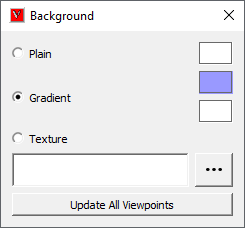

Background
============

    This command allows user to set new background type.                  
                                                                          
**Background panel**

======================================= ============================================

**Plain**                                 Mono color as background

**Gradient**                              Gradient of two colors as background. Default type of application

**Texture**                               Image Texture as background

**Update All Viewpoints**                 Updates Background for all existing viewpoints.

======================================= ============================================    

**How to change background into Plain Background?**
                                                                         
    -  Click Background icon |image1| in Edit toolbar.                
    -  It pops up background panel.                                       
    -  |image2|                                                 
    -  Make sure that option **Plain** is checked.                        
    -  Click on the default background color straight against check box.  
    -  Choose any color from color dialog.                                
    -  Click Ok.                                                          
                                                                          
**How to change Background into Gradient?**                   
                                                                                                     
    -  Click **Gradient** option.                                         
    -  By default, a gradient of blue and white color are applied.        
    -  Change the two colors as done in 'Plain' option.                   
    -  View the change in viewer.                                         
                                                                          
**How to change Background into Texture?**                 
                                                                                                
    -  Click **Texture** option.                                          
    -  Click right most file browser button.                              
    -  It pops up file browser dialog.                                    
    -  Select an image file  and click Open..                             
    -  Texture mode option is enabled and visible, if 'Texture' option is 
       checked.                                                           
    -  Texture Mode' option decides whether the image should be centered  
       or stretched or tiled or fit view. 'Center' option is the default.             
    -  User can select any of these options 'Center', 'Stretch', 'Tile' and 'Fit View'.                                                            
                                                                          
    The following table shows the images with different background type.  
                                                                          
   |image3|                           

.. |image1| image:: images/Background.png
   :width: 50px
   :height: 50px

.. |image3| image:: images/Background_Example.png

