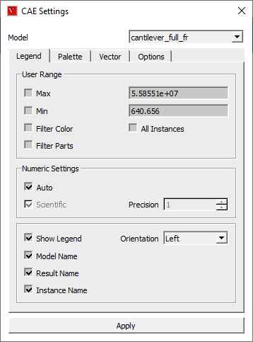
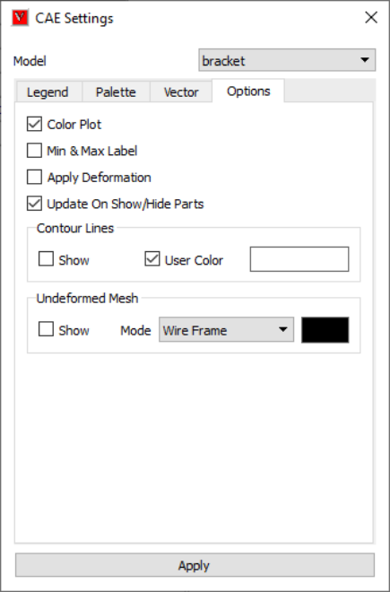
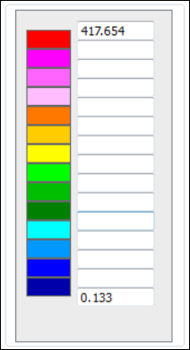
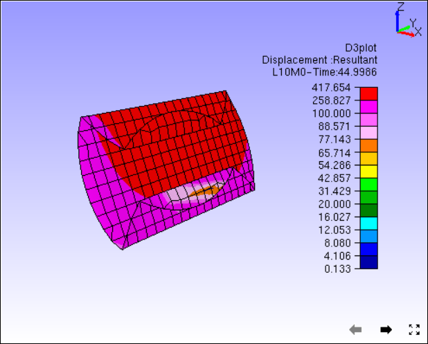
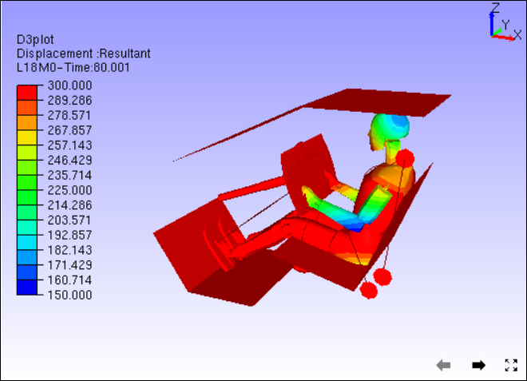
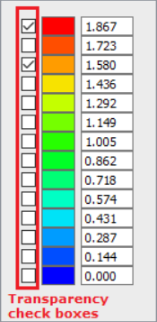

CAE Settings
=============

This section helps user to edit CAE result range, colors, format of
legend values, vector plot etc.

CAE settings dialog contains four sections as below.

.. -  `Legend <#Legend>`__

**Legend**

   User can,

   -  edit result range, and filter color & parts based on the range,
   -  edit numeric format,
   -  toggle legend visibility and
   -  Orient the legend to left/right/top/bottom.

.. -  `Palette <#Palette>`__

**Palette**

   User can,

   -  edit number of palette colors,
   -  edit a color mapped to a range,
   -  edit value range of a color and interpolate
   -  Reverse the colors,
   -  toggle between continuous and discrete
   -  edit background & font size.

..  `Vector <Vector_Plot.html>`__

**Vector**

   User can,

   -  show/hide
   -  scale vector length,
   -  change arrow color and size
   -  set nodal vertex as start or end point
   -  reverse vector direction

.. -  `Options <#Options>`__

**Options**

   User can

   -  Show /Hide color plot, min-max labels, contour lines and
      undeformed mesh,
   -  Apply/ Remove deformation
   -  change undeformed mesh mode.

**Legend**

   |image1|

         +-------------------+-------------------------------------------------+
         | **Model**         | Allows user to select a CAE model.              |
         +-------------------+-------------------------------------------------+
         | **Min**           | Enables to modify min value in the range.       |
         +-------------------+-------------------------------------------------+
         | **Max**           | Enables to modify max value in the range.       |
         +-------------------+-------------------------------------------------+
         | **Filter color**  | Filters the contour beyond range with *No       |
         |                   | Result* color.                                  |
         +-------------------+-------------------------------------------------+
         | **Filter Parts**  | Filters Parts which falls beyond result range.  |
         +-------------------+-------------------------------------------------+
         | **All Instances** | Applies the modification to all instances       |
         +-------------------+-------------------------------------------------+
         | **Scientific**    | Allows user to change the numeric format from   |
         |                   | decimal to scientific.                          |
         +-------------------+-------------------------------------------------+
         | **Precision**     | Allows user to edit the precision value.        |
         +-------------------+-------------------------------------------------+
         | **Show Legend**   | Allows user to show/hide legend.                |
         +-------------------+-------------------------------------------------+
         | **Orientation**   | Allows user to change legend orientation from   |
         |                   | left to right/top/bottom.                       |
         +-------------------+-------------------------------------------------+
         | **Model Name**    | Displays/Hides the model name in the legend     |
         |                   | header.                                         |
         +-------------------+-------------------------------------------------+
         | **Result Name**   | Displays/Hides the result name in the legend    |
         |                   | header.                                         |
         +-------------------+-------------------------------------------------+
         | **Instance Name** | Displays/Hides the instance name in the legend  |
         |                   | header with attributes.                         |
         +-------------------+-------------------------------------------------+

**Palette**

        |image2|

.. note::

   Check boxes near palette colors are used to apply or remove transparency in the color.

+---------------------------+-----------------------------------------+
| **Number of Colors**      | Allows user to edit number of colors    |
|                           | for the palette.                        |
+---------------------------+-----------------------------------------+
| **Reverse**               | Reverses the palette color.             |
+---------------------------+-----------------------------------------+
| **Discrete**              | Switches from Continuous to Discrete    |
|                           | contour and vice versa.                 |
+---------------------------+-----------------------------------------+
| **Update All Viewpoints** | Updates CAE settings changes to all     |
|                           | viewpoints.                             |
+---------------------------+-----------------------------------------+
| **No Result**             | Allows user to change *No Result*       |
|                           | color.                                  |
+---------------------------+-----------------------------------------+
| **Background**            | Allows user to apply/ remove background |
|                           | and to edit color.                      |
+---------------------------+-----------------------------------------+
| **Inverse Transparency**  | Inverts the transparency check box      |
|                           | selections.                             |
+---------------------------+-----------------------------------------+
| **Clear Transparency**    | Clear all color transparency flags.     |
|                           | (Unchecks all boxes against colors)     |
+---------------------------+-----------------------------------------+
| **Font Size**             | Allows user to change font size between |
|                           | *Small/Medium/Large*                    |
+---------------------------+-----------------------------------------+
| **Clear**                 | Clears the palette color value range    |
|                           | except min and max and allows user to   |
|                           | edit.                                   |
+---------------------------+-----------------------------------------+
| **Fill**                  | Interpolate the values for undefined    |
|                           | color range (blank cells).              |
+---------------------------+-----------------------------------------+
| **Apply**                 | Applies all the modifications.          |
|                           |                                         |
+---------------------------+-----------------------------------------+

**Options**

   |image3|

   +-----------------------+---------------------------------------------+
   | **Color Plot**        | Applies/Removes contour color from the      |
   |                       | model.                                      |
   +-----------------------+---------------------------------------------+
   | **Min & Max Label**   | Shows/Hides min/max label.                  |
   +-----------------------+---------------------------------------------+
   | **Apply Deformation** | Applies/Removes deformation to/from model.  |
   +-----------------------+---------------------------------------------+
   | **Contour Lines**     | Allows user to show/hide and to edit color  |
   |                       | of contour lines.                           |
   +-----------------------+---------------------------------------------+
   | **Undeformed Mesh**   | Allows user to show/hide undeformed mesh in |
   |                       | different modes and to edit mesh color.     |
   +-----------------------+---------------------------------------------+

**How to update Legend with user defined range?**

-  Click 'CAE \| CAE Settings'.
-  Click 'Legend Setting' tab in the popped up dialog.
-  Click Min and Max options to change range.
-  Enter the new range values.
-  Click Filter option.
-  It enables color window box.
-  Select a color to be applied for results which are beyond the user
   range.
-  Click 'Update Current Instance' button.
-  Observe the changes in the viewer.

**How to edit Legend and Palette attributes?**

-  Click 'CAE Settings' icon |image4|.
-  Click 'Palette' tab.
-  Select "preset#3" in palette dropdown.

   |Palette_Example|

-  Click 'Apply' and observe the changes in the viewer as below.

   |image5|

-  Click Move Label icon |image7|,
-  Click on palette color and drag to right side of the viewer.
-  Click Legend tab,
-  Select  *Right* option under Orientation drop down.

   |image8|

-  Go back to Palette tab,
-  Check 'Discrete' option and click apply.
-  Palette is changed to discrete color from continuous color.

   |image9|

-  Click *Clear* button to clear the values in between min and max
   values,

   |image10|

-  Enter any cell with a value which lies in the min and max interval
   but in descending order.

   |image11|

-  Click *Fill* button to interpolate for empty cells.

   |image12|

-  Click Apply and notice the changes in the contour.

   |image13|

**How to visualize specific result  contour range or zones?**

-  Load 'Airbag.cax' from VCollab samples folder.

-  Select *L18M0* instance

-  Click *Legend* tab.

-  Change Min and Max Range,

   |image14|

-  Click Apply

   |image15| 

-  To filter the contour color beyond user range, click 'Filter' option
   and Apply.

   |image16| 

-  To hide the parts beyond range, click Filter Parts and Apply.

   |image17| 

-  User can visualize the interested result zone clearly with the above
   options.

**Color Plot with Transparency**

User can turn on or off the transparency for each color by checking or unchecking the check box located in left of each color in the palette.  Transparency level can be modified using Edit Settings -> Options -> Transparency.

|image18|

**Color Plot without and with transparency**

|image19|

.. |image2| image:: images/CAE_Settings_Palette_Panel.png

.. |image5| image:: images/Palette_Colors_Preset3.png

.. |image7| image:: images/MoveLabel.png

.. |image9| image:: images/Contour_Discrete.png

.. |image11| image:: images/Palette_Values_Fill_Few.png

.. |image12| image:: images/Palette_Values_Interpolated.png

.. |image16| image:: images/Contour_filter_Color.png

