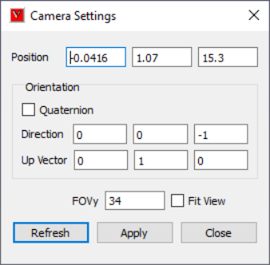
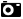

Camera Settings
================

This option helps user to change the camera view orientation by       
allowing to modify the camera attributes.  

**camera-settings-panel**                                       
                                                                          
       |image1|                                                  
                                                                          
                                                                          
===============================================  ==========================================================================                                                                          
**Quaternion**                                     Toggles to Axis & Angle attributes.

**Position**                                       Allows user to modify camera position coordinates.

**Direction/Orientation**                          Allows user to modify camera direction vector/ orientation axis and angle in case of quaternion option.

**Up Vector**                                      >Allows user to modify camera Up vector.

**Vertical FOV**                                   This refers to camera 'Vertical Field of View' in case of Perspective.

**Fit View**                                        If user is not sure about the model in scene after applying the modifications, this option helps to bring model into scene with same direction vector.

**Refresh**                                         Click this option to update the current camera attributes to this dialog.

**Apply**                                           Click to apply all the attributes to the camera.

===============================================  ==========================================================================

.. note::

   Up vector should be perpendicular to Direction vector. If   
   not, a projected vector of user given Up vector will be applied. A    
   new field, Angle, is displayed if Quaternion option is selected.      
                                                                          
**how-to-change-camera-attributes**  
                          
                                                                          
    -  Click Camera Settings icon  |image2| in the Edit toolbar.          
    -  It pops up Camera Settings dialog.                                 
    -  Enter camera position by x, y and z coordinates.                   
    -  Enter Vertical FOV to change the field of view.                    
    -  To change the camera orientation, there are two ways of modifying. 
       Using Direction and Up vectors.                                    
                                                                          
       -  Provide direction and up vectors in the corresponding fields.   
                                                                          
       Using Axis and Angle of camera orientation.                        
                                                                          
       -  Check Quaternion option.                                        
       -  In the Orientation field, provide axis of rotation in first 3   
          x, y and z fields.                                              
       -  Provide angle of degrees in the last field, Angle.              
                                                                          
    -  Click Apply button.                                                
    -  Notice the change in camera view.                                  
    -  If user is not sure about model view, check 'Fit View' option      
       which helps in viewing model in the scene with modified direction. 
    -  In case of Fit View, camera position may be different from user    
       defined position.                                                  

  
