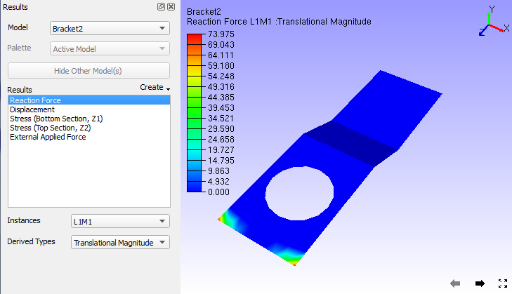
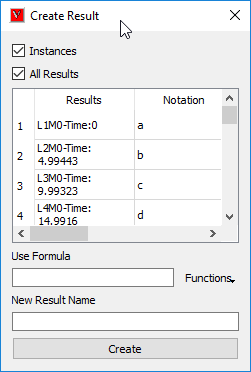
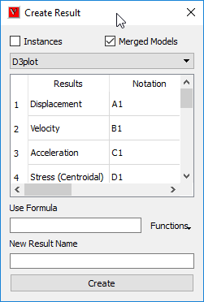

Create Result using Expression
===============================

    This command helps user to create or generate a new CAE result from   
    existing results.                                                     
                                                                          
    User can compute or create a new CAE result for                       
                                                                          
    -  Combining results.                                                 
    -  Average of two or more results.                                    
    -  Difference between two results.                                    
    -  Summation of two derived results.                                  
    -  Scaled result, etc.                                                
                                                                          
    User has to provide an expression or formula with notations available 
    with arithmetic operators. New result will have same number of        
    instances as other results have.                                      
                                                                          
.. note::                                                                
                                                                          
    -  The computed new result will be updated to CAE \| Result List      
       immediately and user can view the result same as other results.    
    -  Complex results are not supported.                                 
                                                                          
**Create Result Panel**
                                      
                                                                          
       |image1|                                                           
                                                                          
                                                                          
======================================  =============================================================
**Instances**                            Enables Instance Creation.

**Results**                              Column header for existing Results.

**Notations**                             Column header for notations. Simple Alphabet Notation which refers to the result in first column. Every result has its own unique alphabet notation.

**Result Type**                           Column header which displays result type of corresponding result in first column. It Lists the types of result either Scalar or Vector or Tensor. An acronym in the bracket specifies if the result is of nodal or elemental or element nodal type. N, E and EN refers to nodal, elemental and element nodal respectively.

**Use Formula**                          Enter an expression with arithmetic operators, notations and constants.

**New Result Name**                      User has to provide a new name for new result.

**Create Result**                        Evaluates the expression in the formula bar and pops up a message "Success" or an error message if any error occurs.

======================================  =============================================================                                                                          

.. note::

      Non-Scalar type results (SixDOF, Vector and Tensor) are highlighted 
      in blue color in the list.                                          
                                                                          
**Consequence of new result creation**
                         
                                                                          
       Creation of new CAE result                              
                                                                          
       -  A message will be popped up with message "New result is created 
          and added successfully".                                        
       -  New Result Name will be added to the CAE \| Result List panel   
          as well as  this panel.                                         
       -  New Result contains same number instances as any other result   
          have.                                                           
                                                                          
**Mouse Click Events**
                                         
                                                                          
       Double click on  a notation:                                       
                                                                          
       -  This event copies the notation clicked and pastes in the        
          formula bar.                                                    
                                                                          
       Right mouse click on a non-scalar result:                          
                                                                          
       -  This event drops down a context menu                            
       -  The context menu lists a set of derived result names based on   
          the result type of selected CAE result.                         
       -  The user selected derived result name will be added at the end  
          of result list temporarily for computation.                     
       -  The added derived result name is of the form, "Result Name -    
          Derived result name" (Eg. Displacement-Translational            
          Magnitude).                                                     
       -  Notation and result type will be created automatically. But     
          this is a temporary addition only.                              
       -  User can use this notation for computation.                     
       -  All the temporary derived result names will be cleared if the   
          dialog is refreshed.                                            
                                                                   
          Context Menu for Six Degrees of Freedom result                
                                                                          
             |image2|                                                     
                                                                          
           Context Menu for Vector                                       
                                                                          
             |image3|                                                     
                                                                          
           Context Menu for Tensor                                       
                                                                          
             |image4|                                                     
                                                                          
**List of Operators**
                                      
                                                                          
       ================================ ==============================    
       Addition                          ' + '                            
       Subtraction                       ' - '                            
       Multiply                          ' \* '                           
       Division                          ' / '                            
       Open bracket                      ' ( '                            
       Close bracket                     ' ) '                            
       Cosine Functions                 sin[ ], cos[ ], tan[ ], log[ ]    
       Square and Square root functions  sqr[ ], sqt[ ]/sqrt[ ]           
       Absolute Function                Abs()                             
       ================================ ==============================    
                                                                          
Operands                                                   
                                                                          
         Create result panel lists a set of notation for results which    
         are automatically created. These notations can be used in the    
         formula bar.   

         Notations will be in capital letters for result creation and in  
         small letters for instance creation.                             
                                                                          
    The valid operands are of,                                            
                                                                          
    -  Any alphabet notation which refers to a CAE result in the create   
       result dialog.                                                     
    -  Any constant expression like 233, 0.455.                           
                                                                          
**Syntax for simple expression or formula**
                   
=============== ========================================== ========================================================================================================                                                                          

S.No             Expression /Formula                        Description

1                  A+B                                      Addition of Results A & B.

2                  A*B                                      Multiplication of results A & B.

3                  A-B                                      Subtraction result B from result A

4                  A/B                                      Division by result B over result A.

5                  Sin[B]                                   Sinusoidal result of result B.

6                  3*A or A*3                               Scalar Multiplication of result A.

7                  A+((-B*C)/(2*D))*cos[B]                   A typical lengthy expression.

8                  -A                                       unary minus '-' operation on result A

9                  A * (-B)                                  Multiplication of  result A and minus of result B.

10                 Abs(A+B)                                  Sum the results A and B. compute  absolute result of summed result.

11                 Sqr[A]                                    computes the square for each component or derived scalar.

12                 Sqt[A]                                    computes the square root for each component or derived scalar.

=============== ========================================== ========================================================================================================  
                                                                          
.. note::

   Function parameters should be inside the square brackets, i.e. [ ]  
   for Sin, Cos, Tan, Sqr and Sqt funcitons.                           
                                                                          
**Example**
                                                  
                                                                          
    The following images describes addition of two results. Note the      
    contour color applied on the model and legend values for each result. 
                                                                          
    Result one: Reaction Force                                            
                                                                          
       |image5|                                                           
                                                                          
    Result two: External Applied Force                                    
                                                                          
       |image6|                                                           
                                                                          
    New Result created: CombineReactionNExternalForce                     
                                                                          
       |image7|                                                           
                                                                          
                                                                          
                                                                          
**How to add two results and create a new result?**
             
                                                                          
    -  Click 'Create Result' icon |image8|                                
    -  It pops up 'Create Result' dialog.                                 
    -  Enter the notation for first result in the formula bar, Say 'A'.   
    -  Enter the addition operation '+'.                                  
    -  Enter the corresponding notation for second result Say 'B'. so the 
       expression is 'A+B'.                                               
    -  Enter a name for new result.                                       
    -  Click 'Create Result'.                                             
    -  Wait for a message "Successfully created and added".               
    -  Computed result will be added to 'Result List' dialog.             
    -  Error message will popup if there is improper expression.          
    -  Click 'Result List' icon |image9|.                                 
    -  It pops up 'Result List' dialog.                                   
    -  Click the new name appended to the list and                        
    -  Interpret the results.                                             

**How to find and view the difference between two results?**

                (OR)

**How to create a new result which refers the difference between two existing CAE results?**

                                                                          
    -  Click 'Create Result' icon |image10|.                              
    -  It pops up 'Create Result' dialog.                                 
    -  Enter the notation for first result in the formula bar, Say 'A'.   
    -  Enter the subtraction operation '-'.                               
    -  Enter the corresponding notation for second result Say 'B'. so the 
       expression is 'A-B'.                                               
    -  Enter a name for new result.                                       
    -  Click 'Create Result'.                                             
    -  Wait for a message "New result is created and added successfully". 
    -  Computed result will be added to 'Result List ' dialog.            
    -  Error message will popup if there is improper expression.          
    -  Click 'Result List' icon |image11|.                                
    -  It pops up 'Result List' dialog.                                   
    -  Click the new name appended to the list and                        
    -  Interpret the results.                                             
                                                                          
**How to add or multiply a scalar value to the result?**
                                                                                 
    -  Click  'Create Result' icon |image12|.                             
    -  It pops up 'Create Result' dialog.                                 
    -  Enter a constant, say '23' or.                                     
    -  Enter the addition operation '+' or multiplication operation ' \*  
       '.                                                                 
    -  Enter the corresponding notation for second result Say 'B'. (like  
       '23*B').                                                           
    -  Enter a name for new result.                                       
    -  Click 'Create Result'.                                             
    -  Wait for a message "New result is created and added successfully". 
    -  Computed result will be added to 'Result List ' dialog.            
    -  Error message will popup if there is improper expression.          
    -  Click 'Result List' icon |image13|.                                
    -  It pops up 'Result List' dialog.                                   
    -  Click the new name appended to the list and                        
    -  Interpret the results.                                             
                                                                          
**How to divide a result by another one?**
                    
                                                                          
    -  Click  'Create Result' icon |image14|.                             
    -  It pops up 'Create Result' dialog.                                 
    -  Enter the notation for first result in the formula bar, Say 'A'.   
    -  Enter the addition operation '/'.                                  
    -  Enter the corresponding notation for second result Say 'B'. so the 
       expression is 'A/B'.                                               
    -  Enter a name for new result.                                       
    -  Click 'Create Result'.                                             
    -  Wait for a message "New result is created and added successfully". 
    -  Computed result will be added to 'CAE \| Result List ' dialog.     
    -  Error message will popup if there is improper expression.          
    -  Click 'Result List' icon |image15|.                                
    -  It pops up 'Result List' dialog.                                   
    -  Click the new name appended to the list and                        
    -  Interpret the results.                                             
                                                                          
.. note::                                                               
                                                                          
   -  Users are recommended to take more care while handling the         
      operator '/', and make assure that divider is not zero.            
   -  if divider = 0, then it leads to in-appropriate results.           
                                                                          
**How to use sin or cosine functions in the formula?**
        
                                                                          
    -  Click  'Create Result' icon |image16|.                             
    -  It pops up 'Create Result' dialog.                                 
    -  User can either use functions for constant or a variable.          
    -  For example, Sin[0.23], Log[B], Cos[A-B].                          
    -  Enter a name for new result.                                       
    -  Click 'Create Result'.                                             
    -  Wait for a message "New result is created and added successfully". 
    -  Computed result will be added to 'CAE \| Result List ' dialog.     
    -  Error message will popup if there is improper expression.          
    -  Click 'Result List' icon |image17|.                                
    -  It pops up 'Result List' dialog.                                   
    -  Click the new name appended to the list and                        
    -  Interpret the results.                                             

.. note::                                                                                                                                           
                                                                          
    -  Function parameters should be inside the **square** brackets.      
                                                                          
**How to use absolute functions in the formula?**

    -  Click  'Create Result' icon |image18|.                             
    -  It pops up 'Create Result' dialog.                                 
    -  User can use either of the following syntax styles.                
                                                                          
       -  Abs(), ABS(), abs().                                            
                                                                          
    -  For example, Abs(A+0.5*B) or simply Abs(B).                        
    -  Enter a name for new result.                                       
    -  Click 'Create Result'.                                             
    -  Wait for a message "New result is created and added successfully". 
    -  Computed result will be added to 'CAE \| Result List ' dialog.     
    -  Error message will popup if there is improper expression.          
    -  Click 'Result List' icon |image19|.                                
    -  It pops up 'Result List' dialog.                                   
    -  Click the new name appended to the list and                        
    -  Interpret the results.                                             
                                                                          
                                                                          
**Different cases of Result Creation**
                       
                                                                          
..    #. `Creating a new CAE result in a single model. <#NewResult>`__      
..    #. `Creating a new Instance. <#NewInstance>`__                        
..    #. `Creating a new CAE result across merging models. <#MergedModel>`__                           
                                               
                                                                          
**Case 1: Creating a new CAE result in a single model.**
                                                 
                                                                          
    -  Load a cax model, which contains CAE data.                         
    -  Click '*Create Result'* icon |image20|.                            
    -  It pops up the panel as below,   
    
       |image21|                                                          
    -  Provide the expression or formula in the *Use Formula* text box.   
    -  Expression should be of meaningful with proper notations,          
       operators and constants.                                           
    -  For example - *"A+B/E"*.                                           
    -  Provide a name for the new result.                                 
    -  Click *'Create Result'*.                                           
    -  It pops up a message box with any one of the following messages,   
    -  "New Result is created and added successfully" or "_Error! ....."  
                                                                          
**Case 2: Creating a new CAE instance in a single model.**
                                             
                                                                          
    -  Load a cax model, which contains CAE data.                         
    -  Click '*Create Result'* icon |image22|.                            
    -  It pops up the panel.                                              
    -  Check *'Instances'* option. *'All Results'* option will be         
       enabled.    
       
       |image23|                                                          
    -  User can create the new instance to current selected CAE result or 
       all results.                                                       
    -  This can be controlled by the option 'All Results'                 
    -  Provide the expression or formula in the *Use Formula* text box.   
    -  Expression should be of meaningful with notation alphabets,        
       operators and constants.                                           
    -  For example - *"2*a+3*b"*                                          
    -  Provide a name for the new instance.                               
    -  Click *'Create Instance'*.                                         
    -  It pops up a message box with any one of the following messages    
    -  "New Instance is created and added successfully" or "_Error!       
       ....."                                                             
                                                                          
**Case 3: Creating a new CAE result across merged models.**
                                               
                                                                          
    -  Load a cax model, which contains CAE data.                         
    -  Merge one or more cax files or models.                             
    -  Click '*Create Result'* icon |image24|.                            
    -  It pops up the panel as below.                                     
    -  Check the option *'Merged Models',* which opens a combo box of     
       merged files as below,    
       
       |image25|                                                          
    -  Notations changes accordingly with an extension of model number.   
       *'A1'* refers to the first result of model 1 and *'B2'* refers to  
       the second result of model 2.                                      
    -  User can create the new instance to current selected CAE result or 
       all results.                                                       
    -  This can be controlled by the option 'All Results'.                
    -  Provide the expression or formula in the *Use Formula* text box.   
    -  Expression should be of meaningful with notation alphabets,        
       operators and constants.                                           
    -  For example - *"B2-B1"*                                            
    -  Provide a name for the new result.                                 
    -  Click *'Create Result'*.                                           
    -  It pops up a message box with any one of the following messages    
    -  "New Result is created and added successfully"                     
    -  "_Error! ....."                                                    
                                                                          
**Examples**
                                                 
                                                                          
    The following images describes addition of two results.               
                                                                          
    -  Notice the contour of Result one: Reaction Force 

       |image26|

    -  Notice the contour of Result two: External Applied Force

       |image27|

    -  View the contour of New Result :CombineReactionNExternalForce

       |image28|                                                          

.. |image2| image:: images/Create_Result_Context_6DOF.png

