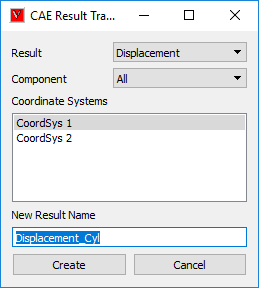
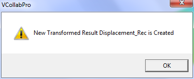

Create Result using Coordinate Transformation
==============================================

VCollab helps user to create a new CAE result by transforming an   
existing result to user defined coordinate system. This is         
applicable for vector and tensor results, not for scalar result.

**Computation of New Result**
                                
                                                                        
New result is computed by transforming the current vector /     
tensor result to new coordinate system.                         
                                                                        
                                                                        
  [New Result Vector / Tensor ] = [Coordinate Transformation] x [Current Result Vector /  Tensor]
                                                                        

**Result Transformation Panel**
                            
                                                                        
        |image1|                                                        

============================ =============================================================================  
 **Result**                     Allows user to select a result to be transformed. This lists all vector and tensor results, not the scalar results.

**Component**                   Lists all possible components and an option to transform all components.

**Coord Systems**               Lists all user defined coordinate systems and allows user to select one UCS for result transformation.

**New Result Name**             A default new result name is constructed based on user selection. However user can edit it. 

**Create**                     Creates a new result into UCS.

============================ =============================================================================

.. **Note:** `Click here to create new coordinate systems. <User_Coordinates_Systems.html>`__                  
    

**How to create a new result using User Defined Coordinate System?**

                                                                         
                                                                        
     -  Make sure that at least one coordinate system is available      
        for result transformation.                                      
                                                                        
     -  Click CAE \| Create Result \| Using Coord Systems...            
                                                                        
     -  It pops up CAE Result Transformation panel.                     
                                                                        
     -  Select a result.                                                
                                                                        
     -  Select a component.                                             
                                                                        
     -  Select a user defined coordinate system from the list.          
                                                                        
     -  Edit default new result name, if necessary.                     
                                                                        
     -  Click *Create* button.                                          
                                                                        
     -  If success, the following message will be popped up.            
                                                                        
        |image2|                                                        
                                                                        
     -  New result will be added to the result list dialog.             
  

