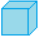
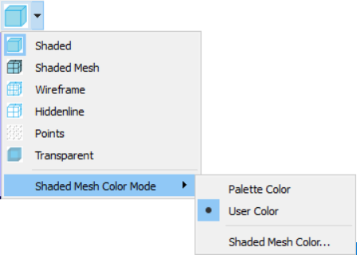
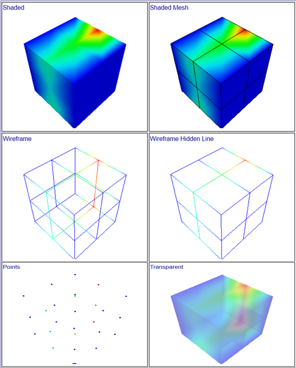

Display Modes
==============                                        
                                                                              
This option allows user to view the model in the following display    
modes,                                                                
                                                                          
    -  Shaded,                                                            
    -  Shaded Mesh,                                                       
    -  Wireframe,                                                         
    -  Hidden Line,                                                       
    -  Point and                                                          
    -  Transparent.                                                       
                                                                          
**Shaded Mesh Color and Mode**                                        
                                                                          
       User can select a mesh color mode,                                 
                                                                          
       -  **User Color** - Mesh line color will be in user defined color. 
       -  **Palette Color** - Mesh line color will be in vertex color     
          mode.                                                           
                                                                          
**Procedure**                                                         
                                                                          
    -  Click 'Display Mode'  icon |image1| in the view toolbar.      
    -  Extended toolbar will appear.                                      
       |image2|                                                     
    -  Click the required display mode icon.                              
    -  Select shaded mesh color mode and color if required.  
    -  User can clear the part/model/element set transparency wherever it comes from.
    -  Click 'Clear Transparency' option if required.             
                     
**Cube model in different Display Modes:**
 
      |image3|
  
   

