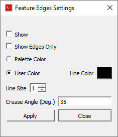
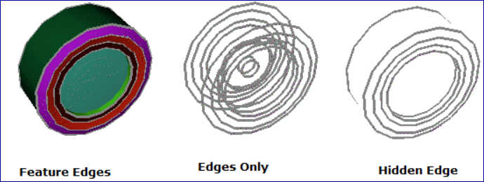
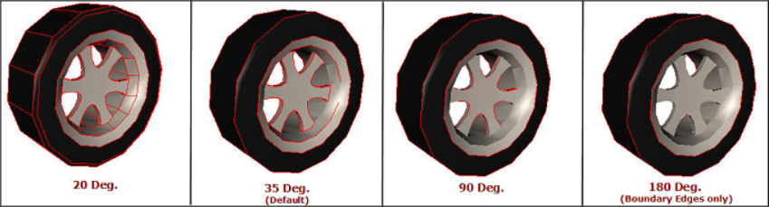

Feature Edges
==============

This command generates and displays feature edges. Feature Edges      
provide us an enhanced 3D visualization of model.                     

**What is a Feature Edge?**
                                                                                                          
An edge shared between two polygons has folding angle more than       
Crease Angle is considered as a Feature Edge?                         

**What is Crease Angle?**
                                                                         
Crease Angle is minimum folding angle between two polygon normals for 
feature edge generation.        

Feature edge display depends on the following attributes,             
                                                                          
    -  Line Color                                                         
    -  Line Size and                                                      
    -  Crease Angle.                                                      
                                                                          
**Feature Edge Settings**                                     
                                                                          
       |image1|             

=================================== =================================================                                      
**show**                              Shows/Hides Feature Edges

**Show Edges**                        Only	Display Feature Edges without shading model.

**Palette color**                     Displays feature edges with palette contour color

**User Color**                        Allows user to select a single color for all the feature edges.

**Line Size**                         Allows user to select line size between 1 to 5.

**Crease Angle**                      Default crease Angle is 35 degrees. User can modify it.

**Apply**                             Applies the modifications.

**Close**                             Closes the window without applying modifications.

=================================== =================================================                                                                      

|Example|

**How to Display Feature Edges?**                             
                                                                          
    -  Click Feature Edge icon |image2| in the View toolbar.        
    -  Feature edges are generated and displayed.                         
    -  Click dropdown arrow near Feature Edge icon.                       
    -  Select Settings option.                                            
    -  Modify feature edge visibility, edge color, detach geometry        
       option, line width size and Crease Angle.                          
    -  Click 'Apply' button to apply the changes.                         
    -  Feature Edges are regenerated according to modifications.

**Feature Edges with different Crease Angles**
                                                                          
       |image3|                                                           

