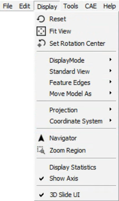

GUI Layout
-----------

|image1|
**Menu Bar**

The Following are the hirarchy of menu bar

|image3|

- File Menu

  |image4|
- Edit Menu

  |image5|

- View Menu

  |image6|
- Tools Menu

  |image7|
- CAE Menu

  |image8|
- Help Menu

  |image9|
- Py_Tools

  |image10|
  
**Tool Bar**
                                                          
The following are list of toolbars                                    
                                                                         
    -  File ToolBar                                                       
    -  CAE ToolBar                                                        
    -  Tools ToolBar                                                      
    -  View ToolBar                                                       
    -  Labels ToolBar                                                     
    -  CAE Display ToolBar                                                
    -  Edit ToolBar                                                       
    -  User can create custom toolbar.                                    
                                                                          
**Note**: Toolbar visibility is based on user profile settings.       
                                                                          
       |image2|                                                           
                                                                          
                                                                       
**Status Bar**  

The status bar is located in bottom and displays description of the 
selected menu item.   

**Dockable Area** 

Product Explorer, Viewpoints, Results List, Hotspot Finder Settings 
and XYPlot dialogs are dockable in the left span by default. All    
can be dockable in right side too. 

**Viewer Window**  

View port is the viewer window.                                     

.. |image7| image:: images/tools_menu.png
.. |image8| image:: images/cae_menu.png
.. |image9| image:: images/help_menu.png

