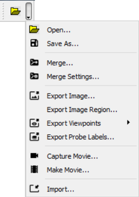

Import
=======

This command helps user to import various data files into VCollab Pro.                                                                  
                                                                          
                                    
                                                                          
    -  \*.py (python script file to run set of commands)                  
    -  \*.csv (User defined result file )                                 
    -  \*.vpt (Viewpoints file)                                           
    -  \*.cax (Viewpoints from cax file) 

                                                                          
**How to run python script files?**                            
                                                                          
    #. Select Import option in the File toolbar,                          
                                                                          
       |image1|                                                           
                                                                          
    #. Select Python script files **(*.py)**,                             
                                                                          
    #. Click open to run the script.    

**How to import viewpoints from external files?**                                  
                                                                                                                                                         
    #. Launch VCollabPro application.                                     
    #. Load a CAX **(*.cax)** file.                                       
    #. Click Import option in the File toolbar,                           
    #. It pops up file browser dialog.                                    
    #. Select 'Files of Type' as VCollab Files **(*.vpt)** or VCollab     
       Files **(*.cax)**.                                                 
    #. File browser dialog lists all either viewpoint files or CAX files. 
    #. Select a file.                                                     
    #. Click Open to import all view paths from the external file.  

                                                                          
Importing CAE Results
---------------------
                                       
                                                                     
VCollab Pro supports importing of external CAE results from files in  
CSV (comma separated values) format. These results are added as new   
results or instances of existing results. VCollab Pro imports results 
only for the visible parts based on node or element numbers.          
                                                                                                                      

**Sample CSV File**

+----------------------------------------------------------------------------------------------------+
|     #VCOLLAB_RESULTS                                                                               |
|                                                                                                    |
|     Node,Displacement,Stress,                                                                      |
|                                                                                                    |
|     Vector,Tensor,                                                                                 |
|                                                                                                    |
|                                                                                                    |
|     #INSTANCE,L1M1,Label:Step1,Time:0.1                                                            |
|                                                                                                    |
|     1818,0.000000,0.000000,0.000000,0.401617,-0.543105,-0.496605, 0.016011,1.541499,-0.090037,     |
|                                                                                                    |
|     1848,0.000000,0.000000,0.000000,-0.330866,-0.389335,-0.527343,-0.010698,1.284187,-0.019899,    |
|                                                                                                    |
|     1845,0.000000,0.000000,0.000000,-0.486035,-0.668757,-0.667392,-0.024487,1.603551,-0.030750,    |
|                                                                                                    |
|                                                                                                    |
|     #INSTANCE,L2M1,Label:Step2,Time:0.2                                                            |
|                                                                                                    |
|     1818,-0.543105,-0.496605, 0.016011,1.541499,0.000000,0.000000,0.000000,0.401617,-0.090037,     |
|                                                                                                    |
|     1848,-0.010698,1.284187,-0.0198990.000000,0.000000,0.000000,-0.330866,-0.389335,-0.527343,     |
|                                                                                                    |
|     1845,0.000000,0.000000,-0.486035,-0.6687570.000000,0.000000,0.000000,-0.486035,-0.668757,      |
|                                                                                                    |
+----------------------------------------------------------------------------------------------------+

CSV File Format
***************

+-------------+----------------------------------------+---------------------------------------------+
| **Line No** | **Description**                        | **Example**                                 |
+-------------+----------------------------------------+---------------------------------------------+
|    1        | #VCOLLAB_RESULTS                       | Header line to identify VCollab CSV format. |
+-------------+----------------------------------------+---------------------------------------------+
|    2        | Node/Element, Result1, Result2,....    | Use Node for nodal result and Element for   |
|             |                                        | elemental result. All results should be of  |
|             |                                        | same type.                                  |
+-------------+----------------------------------------+---------------------------------------------+
|    3        | Result Types for each result.          | Scalar / Vector / SixDof / Tensor           |
|             |                                        | For complex results:                        |
|             |                                        | Scalr_RI / Vector_RI / SixDof_RI / Tensor_RI|
+-------------+----------------------------------------+---------------------------------------------+
|    4        | #INSTANCE,                             | Each attribute should have key and value    |
|             | [Instance_name1],                      | separated by ':'                            |
|             | Instance attributes                    | For example,                                |
|             |                                        | Time: 1.0, Label:Step-1,                    |
+-------------+----------------------------------------+---------------------------------------------+
|    5        | node/element ID                        |                                             |
|             | value1, value2,                        |                                             |
|             | value3,....                            |                                             |
|             |                                        |                                             |
+-------------+----------------------------------------+---------------------------------------------+
|    6        | node/element ID                        |                                             |
|             | value1, value2,                        |                                             |
|             | value3,....                            |                                             |
|             |                                        |                                             |
+-------------+----------------------------------------+---------------------------------------------+
|    7        | node/element ID                        |                                             |
|             | value1, value2,                        |                                             |
|             | value3,....                            |                                             |
|             |                                        |                                             |
+-------------+----------------------------------------+---------------------------------------------+
|             |   #INSTANCE,                           |                                             |
|             |   [Instance_name2],Instance            |    Multiple instances are supported         |
|    ...      |   attributes                           |                                             |
|             |                                        |                                             |
+-------------+----------------------------------------+---------------------------------------------+
|             |                                        |                                             |
|             |                                        |                                             |
|    ...      |       ...                              |             ...                             |
|             |                                        |                                             |
+-------------+----------------------------------------+---------------------------------------------+
|             | node/element ID                        |                                             |
|    ...      | value1, value2,                        |                                             |
|             | value3,....                            |                                             |
|             |                                        |                                             |
+-------------+----------------------------------------+---------------------------------------------+
|             | node/element ID                        |                                             |
|    ...      | value1, value2,                        |                                             |
|             | value3,....                            |                                             |
|             |                                        |                                             |
+-------------+----------------------------------------+---------------------------------------------+
|             | node/element ID                        |                                             |
|    ...      | value1, value2,                        |                                             |
|             | value3,....                            |                                             |
|             |                                        |                                             |
+-------------+----------------------------------------+---------------------------------------------+
|             |                                        |                                             |
|    ...      |                                        |                                             |
|             |                                        |                                             |
|             |                                        |                                             |
+-------------+----------------------------------------+---------------------------------------------+

====================== ==============================
Supported Result Types Number of Columns (Components)
====================== ==============================
Scalar                 1
Vector                 3
SixDOF                 6
Tensor                 6
====================== ==============================

**Python API Support**

VCollab Pro provides the following methods to export and import result instances.

#. xExportCAEResult(ouput_file_path, result_list,instance_list, precision, scientific_format);
#. xImportCAEResult(csv_file_path);

Refer to VCollab Pro API manual available in the local installation folder for usage and syntax.

**Steps to Import Results from a CSV file**
    #. Launch VCollabPro application.                                     
    #. Load a CAX (\*.cax) file                                            
    #. Click *File \| Import* option.                                     
    #. It pops up file browser dialog.                                    
    #. Select '*Files of Type*' as Result Files (\*.csv)                   
    #. File browser dialog lists all csv files.                           
    #. Select VCollab supported csv file.                                 
    #. Click Open to import all CAE results.                              
    #. Check 'CAE \| Results List' for the result name / instance name.   
                                                                          

