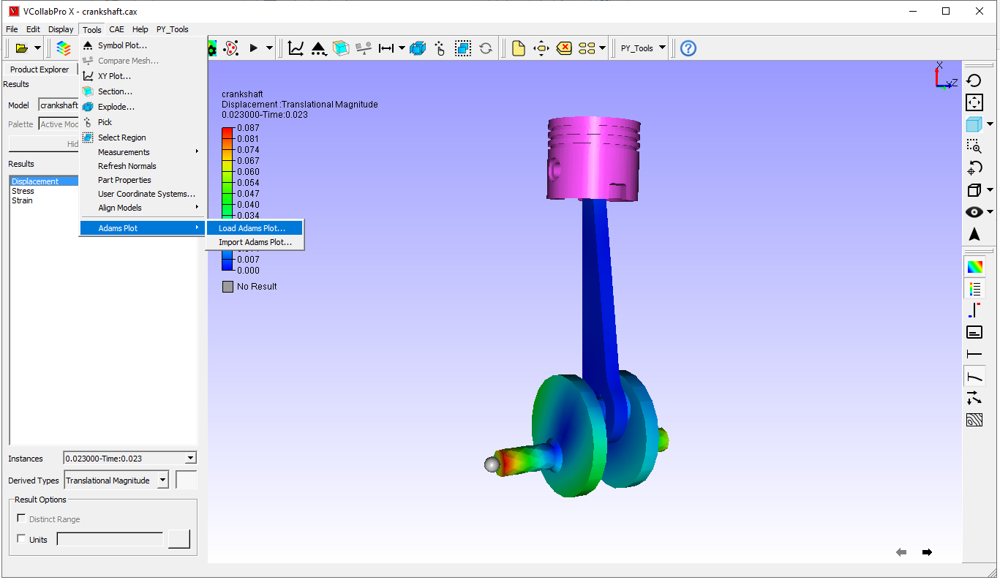
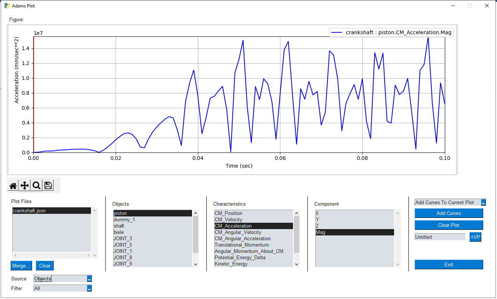

Load Adams Plot
---------------

VMoveAdams creates the plot data in json.gz file along with the CAX file. The file name is same as the CAX file.
The Adams Plots can be drawn using the ‘Tools | Adams Plot | Load Adams Plot’ interface.

|vcprox_adams_load_plot|

This option brings the plot data for the loaded CAX in VCollab Pro. It launches the following window to draw the curves.

|vcprox_adams_plot_window|

The user can draw curves by selecting the differnt parameters listed in the ‘Objects’, ‘Characteristics’, and ‘Components’

The 'Merge...' option in the plot window can be used to bring the curves from different plot files (.json.gz)

