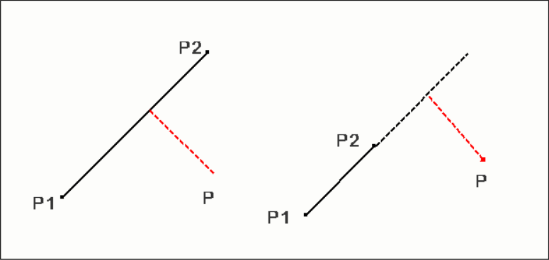
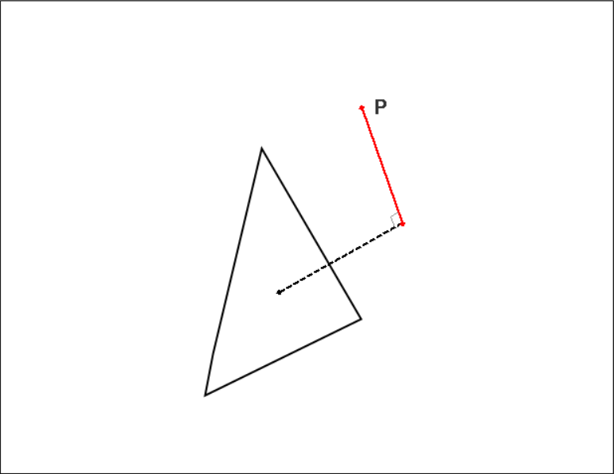
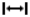
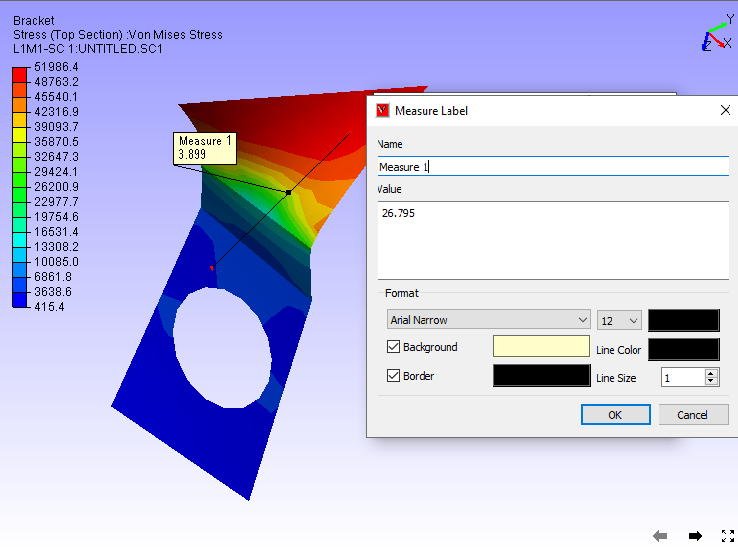
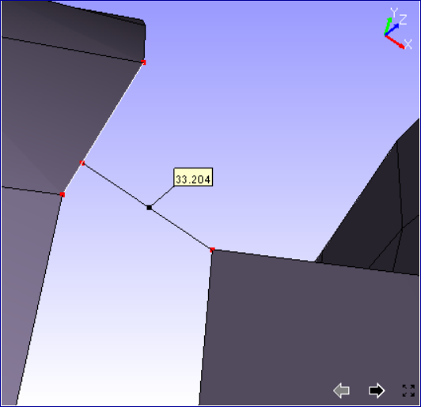
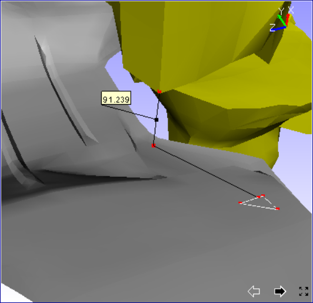
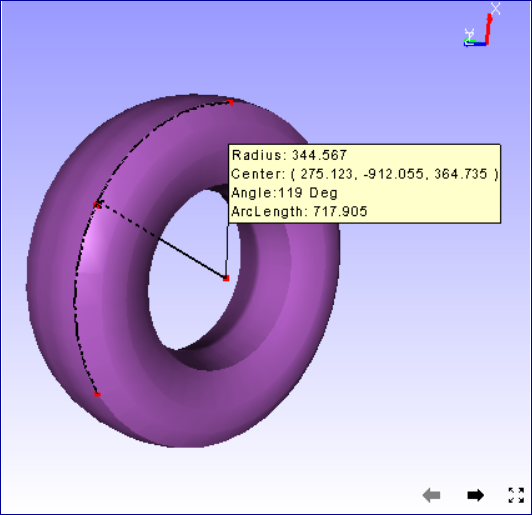

Measurement
===============

The procedures to measure distance between 2 points and measuring the 
arc lengths are explained here. Users can measure the following:      
                                                                          
-  Distance Measurement                                               
-  Arc Measurement                                                    
-  Vertex Info 
-  Export to CSV

.. note::

   Fonts of measurement labels can be modified using **Label Settings** dialog. 

.. `Label Settings <Labels.html>`__                                    
                                                                          
**Measure Options**
                                                                          
-  3D Distance                                                        
                                                                         
   -  Point to Point                                                  
   -  Point to Edge                                                   
   -  Point to Face                                                   
                                                                          
-  Arc                                                                
                                                                          
   -  3 Point Arc                                                     
                                                                          
-  Snap Vertex                                                        
-  Vertex Info                                                        
                                                                          
This helps user to measure shortest 3D distance between two points on 
the model. Annotation labels with measured value will be attached to  
the dimension lines.                                                  
                                                                          
User can measure the linear distance in the following ways,           
                                                                          
#. Point to Point : Measures distance between two user picked points. 
                                                                         
#. Point to Edge: Measures shortest distance between point and the    
   edge picked by user.                                               
                                                                         
   |image1|                                                           
                                                                          
#. Point to Face: Measures shortest distance between point and        
   triangle picked by user.                                           
                                                                          
   |image2|    
                                                                          
**How to measure distance between two points in the model?**
                                                                         
-  Click  the icon |image3| from toolbar.                             
-  Click 2 points of interest on the model to measure the distance.   
-  The points clicked are highlighted in red color and a line is      
   drawn between the end points                                       
-  An annotated label with distance value is attached to the middle   
   point of line drawn.                                               
                                                                  
   |image4|                         
       
-  Double clicking on the measure allows to format the label data and renaming the measure name.                                           
                                                                          
**How to measure distance between point and an edge?**
                                                                         
-  Click 'Point to Edge'.                                             
                                                                          
-  Click a point on a model and click on a model for closest triangle 
   edge.                                                              
                                                                          
-  The point and the closest edge will be highlighted in red color.   
   Edge is extended if foot of perpendicular does not lie in the edge 
   segment.                                                           
                                                                          
-  An annotated label with distance value is attached to the middle   
   point of line drawn.                                               
                                                                          
   |image5|                                                           
                                                                          
**How to measure distance between point and a face?**
                                                                         
-  Click 'Point to Face'.                                             
                                                                          
-  Click a point on a model and click on a model triangle.            
                                                                          
-  The point and triangle points will be highlighted in red color.    
                                                                          
-  An annotated label with distance value is attached to the middle   
   point of line drawn.                                               
                                                                          
   |image6|                                                           
                                                                          
**How to measure circular curve or an arc?**
                   
                                                                         
-  Click  down arrow near measure icon |image7| in toolbar.           
                                                                          
-  Click '3PointArc' option.                                          
                                                                          
-  Click on 3 points of interest on the model.                        
                                                                          
-  An arc is drawn from first point to third point passing through    
   the second point.                                                  
                                                                          
-  All three points are highlighted in red color.                     
                                                                          
-  An arrow is drawn from center of arc to the curve to denote the    
   radius.                                                            
                                                                          
-  An annotated label with arc information is attached to the center  
   of arc.                                                            
                                                                          
-  Curve hidden behind the model is drawn with dashed lines.          
                                                                          
   |image8|                                                           
                                                                          
**What is the use of Snap Vertex option?**
                   
                                                                          
-  User has to pick points in the model for measuring.                
-  Using this 'Snap Vertex' option, user can pick the nearest vertex  
   in the model.                                                      
-  It helps user to measure with extended accuracy.                   
-  Click 'Snap Vertex' in the drop down menu to enable this option.   
                                                                          
**How to display coordinates of a point on the model?**
     
                                                                          
-  Click 'Vertex Info' in the drop down menu to enable this option.   
-  Click on the model.                                                
-  The coordinates  of the clicked position is displayed in a label.  
-  This label is temporary and is cleared on users next click.        
-  User can not save this label into viewpoint.                       
-  This option helps in measure and section modules.     
    
Export to CSV
-------------
This function helps user to export all visible measurement data into a csv file.

User can achieve this either through "Tools | Measurement | Export to CSV" in menu bar or "Measure | Export to CSV" in context menu.

**Sample CSV file**

+-------------------------------------------------------------------------------------------------------------------+
| | # Application Name: VCollab Pro X                                                                               |
| | # Application Version: 4.12.121.605                                                                             |
| | # Date & Time : 21-10-2021, 18:43:30                                                                            |
| | # Current User : karuna                                                                                         |
|                                                                                                                   |
| | # Measure Name, Measure Value, Model Name 1, Model Name 2, Node ID 1,X1,Y1,Z1, Node ID 2,X2,Y2,Z2               |
| | Measure 1,43.046,body1,Fadjuster,NA,-13.8797,-19.9479,41.2141,NA,-0.179211,3.7484,7.99158                       |
| | Measure 2,31.718,body2,Fbody,NA,22.7075,-18.5456,32.922,NA,4.77808,-33.8141,11.6751                             |
+-------------------------------------------------------------------------------------------------------------------+

                                                                          

