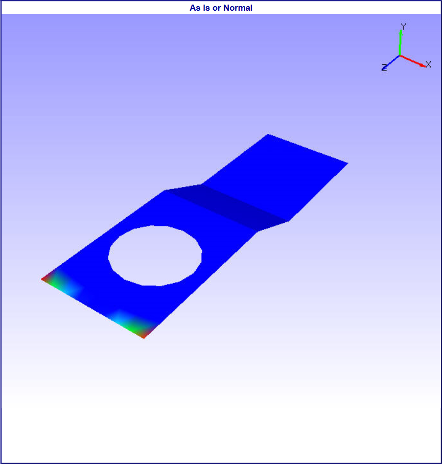
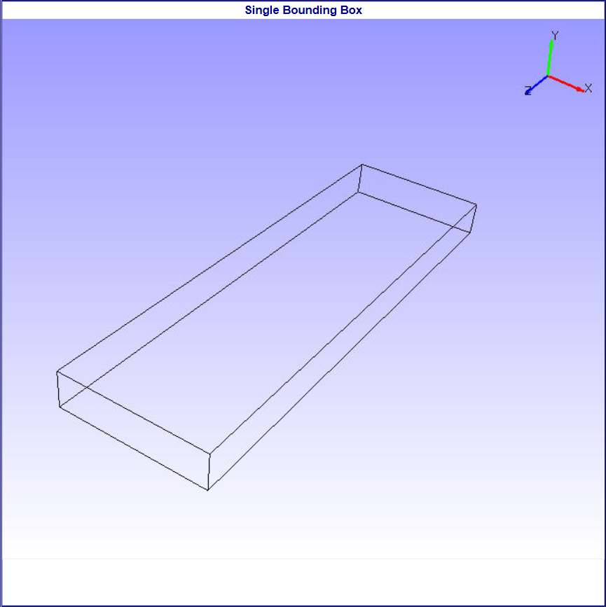

Move Model As
==============

This option helps user to set different performance modes of          
rendering while interacting scene through motion model. These helps   
to improve performance during motion model.                           
                                                                         
**Options**

   - As Is

      This is default one and helps user to change from any other        
      performance mode to current display mode.                          
                                                                         
   - Single Bounding box                                   
                                                                         
      A single bounding box which contain all parts of model is          
      displayed in motion model.                                         
                                                                         
   - Part Bounding boxes                                     
                                                                         
      Individual bounding boxes are displayed for each part in motion    
      model.                                                             
                                                                         
   -  Detail culled                                          
                                                                         
      This helps user to view parts based on volume of all parts. User   
      can view parts which are equal or less or above volumetrically     
      with model volume. The default detail cull percentage is 30%. User 
      can change this using 'Detail Cull Settings' option.               
                                                                         
   -  Feature Edges                                            
                                                                         
      Shows model feature edges during motion model.  

      |image1|     
      |image2|   
      |image3|   
      |image4|                 
      |image5|   
                                                                         
                                            

.. |image3| image:: images/Part_BoundingBoxes.png

.. |image5| image:: images/Feature_Edges.png
                                                                      
                                                                         
                                                                         
                                                                         

