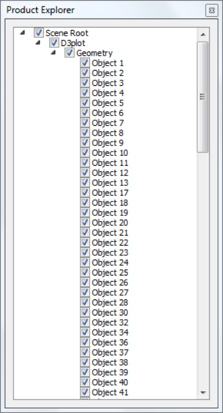

Product Explorer explores the knowledge on product model through hierarchical set up of all nodes.                                              
                                                                          
**Location**

Product Explorer can be found in 'Widgets' items in the right click viewer context menu. It contains four tabs for Scene Tree, Viewpoints,Results, Hotspot Finder and XYPlot.

 |Context Menu|

 |Product Tree|

**Context Menu**

|Transform| 

                                                                          
====================================================== =================================================================================================================                       

Show All                                                 	Shows all parts independent of selection.

Invert Show                                                 Hides visible parts and Shows invisible parts

Hide others                                                 Hides all parts except current selection

Focus                                                       Focus on the selected part or group.

Select                                                      Selects the part by highlighting its bounding box

Add to Selection                                            Adds to the selection list by highlighting parts bounding box

Deselect                                                    Deselects current selection

Transform                                                   Allows user to apply any transformation to the group node. Not applicable for leaf node or individual part.

Display Mode                                                Applies one of the following display modes to the current selection.

                                                            ======================================= ===========================================

                                                            	Shaded	                              : Smooth shade

                                                               Shaded Mesh                          	: Smooth shade with mesh.

                                                               Wireframe	                           : Model as edges

                                                               HiddenLine	                           : Wireframe in which, hidden lines removed

                                                               Point	                                 : Model as points.

                                                               Transparent	                           : Semi-transparent Model.

                                                               Set Random Color	                     : Model parts with random colors.

                                                               Set Color	                           : Allows user to define a color to the part selected.

                                                            ======================================= ===========================================

Find Parts                                              	 Pops up Find Parts dialog for multiple operations on selection of parts.                                                            

Collapse	                                                 Allows user to collapse the tree into multiple levels.(All/ Level 1/  Level 2/ Level 3)

Expand	                                                 Allows user to expand the tree into multiple levels.  (All/ Level 1/ Level 2/ Level 3)

Set As Current Model	                                     Sets the selected root node as current model.

Exclude Section	                                         Allows user to exclude the selected parts from cut-section.

====================================================== =================================================================================================================
                                                                          
**How to Hide/Show a part?**

   - User can hide/show the part in multiple ways.

   - One of them is to check or uncheck the scene tree items to show or hide respectively.

   - User can use double click context menu option to show / hide the parts.

   - Scene tree panel context menu can be used for further part visibility operations.

**How to Select or highlight a part?**

   - Select a part or part component in product tree.
   - Click the right mouse button
   - It drops down a menu.
   - Click 'Select' option 
   - The part will be highlighted with bounding box for the part.
   - Click other parts and add them to highlight using 'Add to selection' in context menu.
   - Use 'Deselect' option to remove the selection of parts.

**How to focus a part among groups?**

   - Select a part in viewer.
   - Right click and select 'Focus' option to fit the part to the viewer window.

**How to delete a part or group of parts?**

User can delete a part or group of parts using product explorer context menu.

   - Select a part node or group node in product tree by clicking on the node.
   - Click the node using mouse right button.
   - It drops down the context menu.
   - Select 'Delete' option.
   - It pops up a message dialog box as below.

      |Delete Warning|

   - Click 'Yes' to assure deletion or 'No' to cancel deletion.
   - The part or group of parts will be deleted from the scene and product tree, if 'Yes' is clicked.

User can delete a part but not group of parts using viewer double click context menu

   - Select a part by double clicking with mouse left button on the part of interest.
   - It drops down a context menu.
   - Select 'Delete' option
   - It pops up a message dialog box as below.

    |Delete Warning|

   -  Click 'Yes' to assure deletion or 'No' to cancel deletion.
   - The part will be deleted from the scene and product tree, if 'Yes' is clicked.
   - User can save the remaining parts into cax. In other words, deleted parts can not be saved in cax.

**How to exclude parts from cut section clipping?**

- Load a cax file
- Switch on section plane.
- Click a part name in product explore, which is clipped by section plane.
- Open context menu using right mouse click inside product explorer panel.
- Click 'Exclude Section'
- The selected part is visible now and not clipped by section plane.
- Repeat the step for other required parts.
- Click or uncheck the option 'Exclude Section' again to include the part again.
.. note::
 - To exclude or include, this function is applied for only one selected part in the product explorer.

.. |Transform| image:: images/PE_ContextMenu.png

