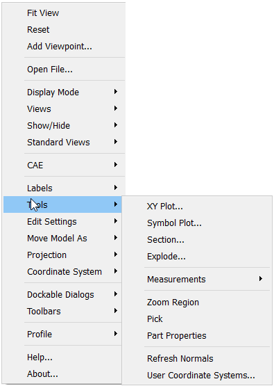

Refresh Normals
=================

Normals during animation are not updated by default. User can enable, 
updating normals during CAE animation in  item in the viewer context menu.            
                                                                         
User can use Refresh Normals option at any time for updating        
normals for current frame model.                                    
                                                                          
       |image1|                                                           

