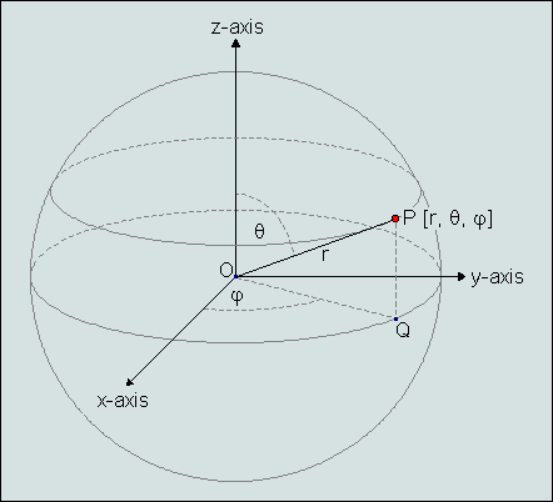

User Coordinate Systems
=======================

Users can define their own coordinate system which can be used     
in visualizing CAE results . VCollab provides different types of   
interfaces to user to define coordinate system.  

**Coordinate System Manager Panel**
                         
                                                                        
        |image1|                                                        
                                                               
+----------------+------------------------------------------+   
| **Name**       | New Coordinate system name.              |   
+----------------+------------------------------------------+   
| **Type**       | Coordinate system type. i.e.,            |   
|                | Rectangular/Cylindrical/Spherical.       |   
+----------------+------------------------------------------+   
| **Definition** | Allows user to select a interface method |   
|                | to define coordinate system.             |   
+----------------+------------------------------------------+   
| **Origin**     | Allows user to pick vertex in model or   |   
|                | enter new origin coordinates separated   |   
|                | by comma.                                |   
+----------------+------------------------------------------+   
| **X Axis**     | Defines X axis vector.                   |   
+----------------+------------------------------------------+   
| **XY Plane**   | Defines Y axis vector.                   |   
+----------------+------------------------------------------+   
| **Create**     | Create new coordinate system and adds to |   
|                | the list box.                            |   
+----------------+------------------------------------------+   
| **Delete**     | Deletes selected coordinate systems by   |   
|                | names.                                   |   
+----------------+------------------------------------------+   
                                                                        
**Types of Coordinate Systems**
                            
                                                                        
     VCollab provides following coordinate system types,                
                                                                        
     #. Rectangular                                          
                                                                        
        A cartesian coordinate system represented as (X, Y, Z) .        
                                                                        
        |image2|                                                        
                                                                        
                                                                        
                                                                        
     #. Cylindrical                                          
                                                                        
        A Polar coordinate system represented as (r, j, Z)              
                                                                        
        Where,                                                          
                                                                        
        r is radial distance from the coordinate to Z axis.             
                                                                        
        j is  angle of deviation from X axis to projection of OP into   
        XY plane (OQ).                                                  
                                                                        
        Z is same as in Cartesian coordinate system.                    
                                                                        
        |image3|                                                        
                                                                        
     #. Spherical                                            
                                                                        
        A Polar coordinate system represented as (r, q, j)              
                                                                        
        Where,                                                          
                                                                        
        r is distance from origin to the coordinate.                    
                                                                        
        q is angle of deviation from X axis to projection of OP into    
        XY plane (OQ).                                                  
                                                                        
        j is angle of deviation from Z axis to the coordinate           
        positional vector OP.                                           
                                                                        
        |image4|                                                        
                                                                        
**Definition of Coordinate System**
                                                                       
        Independent of types, any new coordinate system requires a      
        new origin and orientation relative to global or current        
        coordinate system.                                              
                                                                        
        VCollab provides different ways to user to define a new         
        coordinate system. Origin is common input for all methods.      
        User can pick a vertex in model to define as new origin.        
                                                                        
        -  *X Axis and XY Plane*                                        
                                                                        
           User has to provide 3 points. Pick option can be used to     
           select vertices from the model.                              
                                                                        
           Origin : First Point (P1)                                    
                                                                        
           X axis : Second point - Origin (P2-P1)                       
                                                                        
           Z axis : Cross product of (P3-P1) and (P2-P1)                
                                                                        
           Y axis : Cross product of Z and X axes.                      
                                                                        
           |image5|                                                     
                                                                        
                                                                        
                                                                        
        -  *X Axis and Y Axis*                                          
                                                                        
           Pick options is enabled only for origin.                     
                                                                        
           Origin : Picked or Entered point.                            
                                                                        
           X Axis : Entered by user.                                    
                                                                        
           Y Axis : Entered by user.                                    
                                                                        
                                                                        
                                                                        
        -  *Arbitrary Axis and Angle*                                   
                                                                        
           Pick options is enabled only for origin.                     
                                                                        
           Orientation of new coordinate system is defined here by      
           axis of rotation and angle in degrees.                       
                                                                        
           Origin : Picked or Entered point.                            
                                                                        
           X Axis : Derived from Orientation.                           
                                                                        
           Y Axis : Derived from Orientation.                           
                                                                        
                                                                        
                                                                        
        -  *3 Points Circular*                                          
                                                                        
           User has to pick or enter three non collinear                
           points(P1,P2,P3). Points are considered in periphery of a    
           circle.                                                      
                                                                        
           Origin : Center of circle.                                   
                                                                        
           X Axis : Origin to P1.                                       
                                                                        
           Z Axis : Normal of plane formed by circle.                   
                                                                        
           Y axis : Derived from X and Z axes.                          
                                                                        
           |image6|                                                     

**How to create a new user defined coordinate system (UCS)?**
 
                                                                        
     -  Enter a new coordinate system name.                             
                                                                        
     -  Select coordinate type                                          
                                                                        
     -  Select a method to define a new coordinate system.              
                                                                        
     -  Either enter or pick coordinates to define origin, X and Y      
        axes.                                                           
                                                                        
     -  Click 'Create' button to create an UCS.                         
                                                                        
     -  Created UCS will be listed in the list box with check boxes.    
                                                                        
     -  User can turn ON/OFF UCS visibility in viewer by using check    
        boxes.                                                          
                                                                        
     -  User can select multiple coordinate systems and delete them.    
 

.. |image2| image:: images/Rect_Coord_System.png
.. |image3| image:: images/Cylindrical_Coord_System.png

.. |image5| image:: images/CS_3Pt_XYPlane.png
.. |image6| image:: images/CS_3Pt_Circle.png
